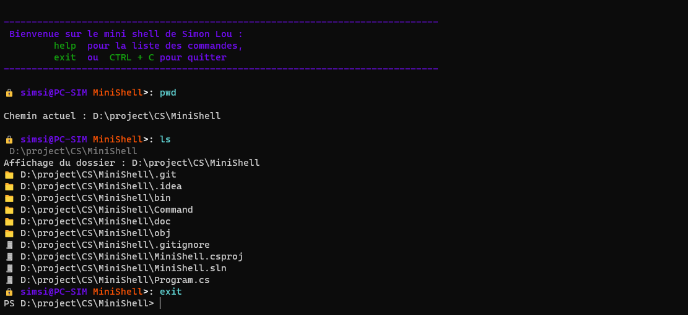

<h1> SimonLou's MiniShell</h1>

 

## Le Projet

Le but est de créer un MiniShell avec quelques commandes et de l'agrémenté au fur et à meusure du temps afin de me créer mon shell parfait.
Il a pour but d'apprendre à mieux maitriser le langages C#

## La réalisation

Pour commencer j'ai écrit comment je pensait faire fonctionner l'algorithme et le programme
<a href="doc/">Il est possible de retrouver toutes mes recherches ici</a>

## Les commandes 

### Implémentés : 
  * pwd *(sans options)*,
  * echo *(sans options)*, 
  * cd *(sans options)*, 
  * mv *(sans options)*, 
  * cp *(sans options)*, 
  * mkdir *(sans options)*, 
  * rm (avec l'option -R), 
  * ls *(sans options)*

### L'objectif :
  * Les commandes php, 
  * Commandes powersell avec la commande pwsh
  * Commandes pour se connecter à mysql
  * Commandes pour se connecter en ssh

## Langage et outils

Pour la réalisation j'utilise le langage c# avec la librairie PromptPlus
